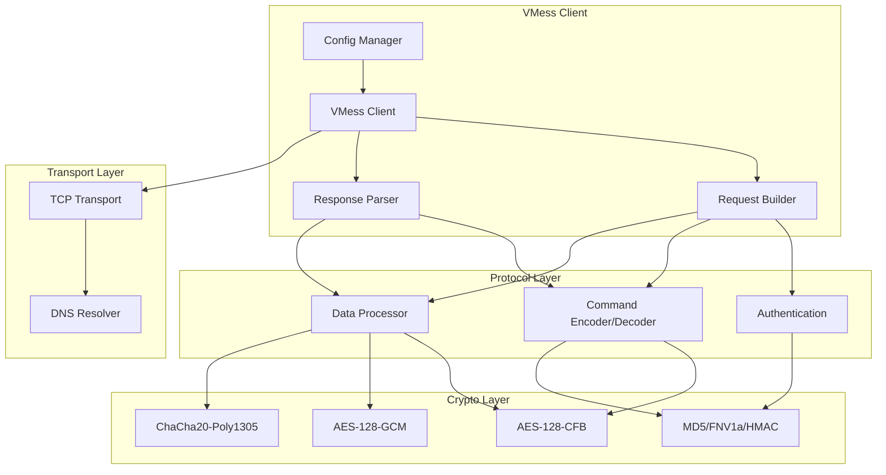
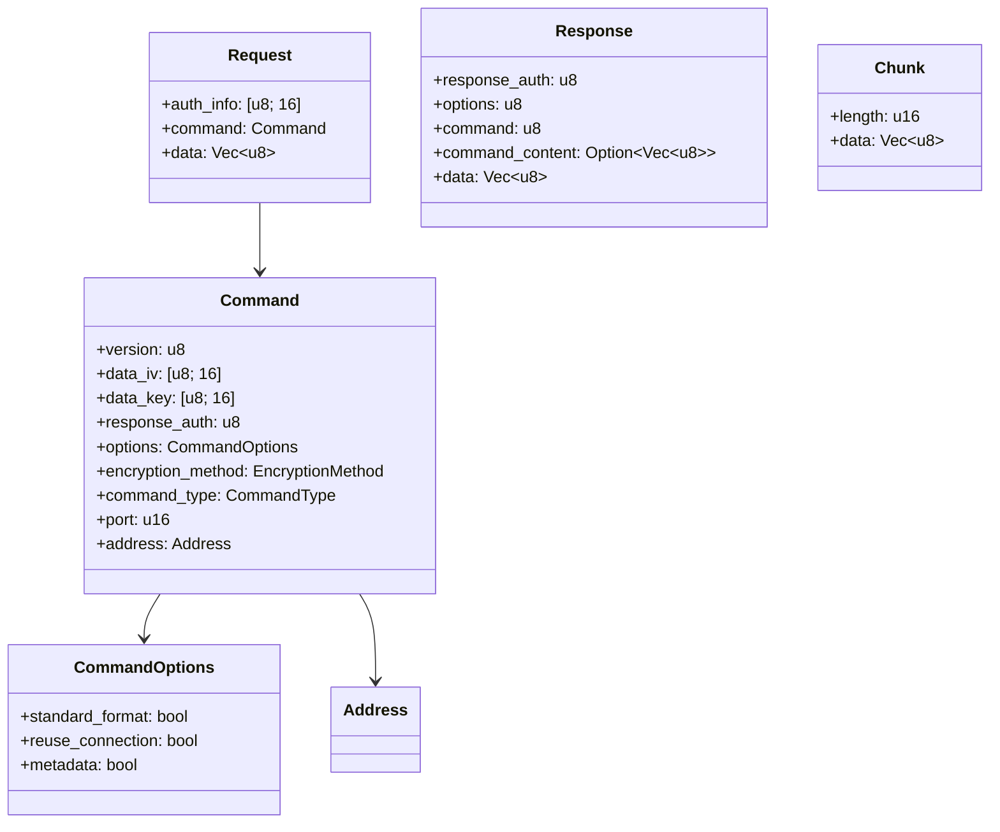

# Design Document: VMess Protocol Implementation

## Overview

本设计文档描述了在 Rust 中实现 VMess 协议的技术架构。VMess 是一个无状态的加密通信协议，设计目标是提供安全、灵活的代理通信能力。

实现将采用模块化架构，分离关注点：
- 加密模块处理所有密码学操作
- 协议模块处理消息编码/解码
- 传输模块处理网络 I/O
- 配置模块处理用户设置

## Architecture



## Components and Interfaces

### 1. User ID Module (`user_id.rs`)

```rust
use uuid::Uuid;

/// 16-byte User ID for VMess authentication
#[derive(Clone, Debug, PartialEq, Eq)]
pub struct UserId([u8; 16]);

impl UserId {
    /// Generate a new random User ID
    pub fn generate() -> Self;
    
    /// Parse from UUID string format
    pub fn from_str(s: &str) -> Result<Self, UserIdError>;
    
    /// Get raw bytes
    pub fn as_bytes(&self) -> &[u8; 16];
    
    /// Convert to UUID string format
    pub fn to_string(&self) -> String;
}

#[derive(Debug, thiserror::Error)]
pub enum UserIdError {
    #[error("Invalid UUID format: {0}")]
    InvalidFormat(String),
}
```

### 2. Authentication Module (`auth.rs`)

```rust
use std::time::{SystemTime, Duration};

/// Authentication information generator and verifier
pub struct Authenticator {
    user_id: UserId,
    time_window: Duration,
}

impl Authenticator {
    pub fn new(user_id: UserId, time_window: Duration) -> Self;
    
    /// Generate 16-byte authentication info using current timestamp
    pub fn generate(&self) -> [u8; 16];
    
    /// Generate authentication info for specific timestamp
    pub fn generate_for_timestamp(&self, timestamp: u64) -> [u8; 16];
    
    /// Verify authentication info within time window
    pub fn verify(&self, auth_info: &[u8; 16]) -> Result<u64, AuthError>;
}

#[derive(Debug, thiserror::Error)]
pub enum AuthError {
    #[error("Authentication failed: timestamp outside allowed window")]
    TimestampOutOfRange,
    #[error("Authentication failed: HMAC mismatch")]
    HmacMismatch,
}
```

### 3. Command Module (`command.rs`)

```rust
/// VMess command section
#[derive(Clone, Debug, PartialEq)]
pub struct Command {
    pub version: u8,
    pub data_iv: [u8; 16],
    pub data_key: [u8; 16],
    pub response_auth: u8,
    pub options: CommandOptions,
    pub encryption_method: EncryptionMethod,
    pub command_type: CommandType,
    pub port: u16,
    pub address: Address,
}

#[derive(Clone, Debug, PartialEq)]
pub struct CommandOptions {
    pub standard_format: bool,  // Opt(S)
    pub reuse_connection: bool, // Opt(R)
    pub metadata: bool,         // Opt(M)
}

#[derive(Clone, Copy, Debug, PartialEq)]
pub enum EncryptionMethod {
    None = 0x00,
    Aes128Cfb = 0x01,
    Aes128Gcm = 0x03,
    ChaCha20Poly1305 = 0x04,
}

#[derive(Clone, Copy, Debug, PartialEq)]
pub enum CommandType {
    Tcp = 0x01,
    Udp = 0x02,
}

#[derive(Clone, Debug, PartialEq)]
pub enum Address {
    IPv4([u8; 4]),
    Domain(String),
    IPv6([u8; 16]),
}

pub struct CommandCodec {
    user_id: UserId,
}

impl CommandCodec {
    pub fn new(user_id: UserId) -> Self;
    
    /// Encode command section with AES-128-CFB encryption
    pub fn encode(&self, cmd: &Command, timestamp: u64) -> Result<Vec<u8>, CommandError>;
    
    /// Decode command section
    pub fn decode(&self, data: &[u8], timestamp: u64) -> Result<Command, CommandError>;
    
    /// Format command as human-readable string
    pub fn pretty_print(cmd: &Command) -> String;
}

#[derive(Debug, thiserror::Error)]
pub enum CommandError {
    #[error("Encryption failed: {0}")]
    EncryptionFailed(String),
    #[error("Decryption failed: {0}")]
    DecryptionFailed(String),
    #[error("Invalid checksum")]
    InvalidChecksum,
    #[error("Invalid address type: {0}")]
    InvalidAddressType(u8),
    #[error("Buffer too short")]
    BufferTooShort,
}
```

### 4. Data Processor Module (`data.rs`)

```rust
/// Chunk-based data processor for VMess data section
pub struct DataProcessor {
    encryption_method: EncryptionMethod,
    key: [u8; 16],
    iv: [u8; 16],
}

/// A single data chunk
#[derive(Clone, Debug, PartialEq)]
pub struct Chunk {
    pub length: u16,
    pub data: Vec<u8>,
}

impl DataProcessor {
    pub fn new(method: EncryptionMethod, key: [u8; 16], iv: [u8; 16]) -> Self;
    
    /// Encode data into chunks
    pub fn encode(&self, data: &[u8]) -> Result<Vec<Chunk>, DataError>;
    
    /// Encode a single chunk
    pub fn encode_chunk(&self, data: &[u8], chunk_index: u16) -> Result<Chunk, DataError>;
    
    /// Decode chunks back to original data
    pub fn decode(&self, chunks: &[Chunk]) -> Result<Vec<u8>, DataError>;
    
    /// Decode a single chunk
    pub fn decode_chunk(&self, chunk: &Chunk, chunk_index: u16) -> Result<Vec<u8>, DataError>;
    
    /// Create end-of-transmission chunk
    pub fn create_eot_chunk(&self) -> Chunk;
    
    /// Check if chunk is end-of-transmission
    pub fn is_eot(&self, chunk: &Chunk) -> bool;
}

#[derive(Debug, thiserror::Error)]
pub enum DataError {
    #[error("Encryption failed: {0}")]
    EncryptionFailed(String),
    #[error("Decryption failed: {0}")]
    DecryptionFailed(String),
    #[error("Authentication failed for chunk {0}")]
    ChunkAuthFailed(u16),
    #[error("Invalid chunk length")]
    InvalidChunkLength,
}
```

### 5. Request/Response Module (`message.rs`)

```rust
/// VMess client request
#[derive(Clone, Debug, PartialEq)]
pub struct Request {
    pub auth_info: [u8; 16],
    pub command: Command,
    pub data: Vec<u8>,
}

/// VMess server response
#[derive(Clone, Debug, PartialEq)]
pub struct Response {
    pub response_auth: u8,
    pub options: u8,
    pub command: u8,
    pub command_content: Option<Vec<u8>>,
    pub data: Vec<u8>,
}

pub struct RequestBuilder {
    user_id: UserId,
    authenticator: Authenticator,
    command_codec: CommandCodec,
}

impl RequestBuilder {
    pub fn new(user_id: UserId) -> Self;
    
    /// Build a complete VMess request
    pub fn build(&self, target: Address, port: u16, data: &[u8], 
                 encryption: EncryptionMethod) -> Result<Vec<u8>, RequestError>;
    
    /// Parse a VMess request
    pub fn parse(&self, data: &[u8]) -> Result<Request, RequestError>;
}

pub struct ResponseParser {
    data_key: [u8; 16],
    data_iv: [u8; 16],
    expected_auth: u8,
}

impl ResponseParser {
    pub fn new(data_key: [u8; 16], data_iv: [u8; 16], expected_auth: u8) -> Self;
    
    /// Parse a VMess response
    pub fn parse(&self, data: &[u8]) -> Result<Response, ResponseError>;
    
    /// Build a VMess response (for server implementation)
    pub fn build(&self, response_data: &[u8]) -> Result<Vec<u8>, ResponseError>;
}

#[derive(Debug, thiserror::Error)]
pub enum RequestError {
    #[error("Authentication error: {0}")]
    Auth(#[from] AuthError),
    #[error("Command error: {0}")]
    Command(#[from] CommandError),
    #[error("Data error: {0}")]
    Data(#[from] DataError),
}

#[derive(Debug, thiserror::Error)]
pub enum ResponseError {
    #[error("Response authentication mismatch")]
    AuthMismatch,
    #[error("Decryption failed: {0}")]
    DecryptionFailed(String),
    #[error("Invalid response format")]
    InvalidFormat,
}
```

### 6. Crypto Module (`crypto.rs`)

```rust
/// AES-128-CFB cipher
pub struct Aes128Cfb {
    key: [u8; 16],
    iv: [u8; 16],
}

impl Aes128Cfb {
    pub fn new(key: [u8; 16], iv: [u8; 16]) -> Self;
    pub fn encrypt(&self, plaintext: &[u8]) -> Vec<u8>;
    pub fn decrypt(&self, ciphertext: &[u8]) -> Vec<u8>;
}

/// AES-128-GCM AEAD cipher
pub struct Aes128Gcm {
    key: [u8; 16],
}

impl Aes128Gcm {
    pub fn new(key: [u8; 16]) -> Self;
    pub fn encrypt(&self, nonce: &[u8; 12], plaintext: &[u8], aad: &[u8]) -> Result<Vec<u8>, CryptoError>;
    pub fn decrypt(&self, nonce: &[u8; 12], ciphertext: &[u8], aad: &[u8]) -> Result<Vec<u8>, CryptoError>;
}

/// ChaCha20-Poly1305 AEAD cipher
pub struct ChaCha20Poly1305Cipher {
    key: [u8; 32],
}

impl ChaCha20Poly1305Cipher {
    pub fn new(key: [u8; 32]) -> Self;
    pub fn encrypt(&self, nonce: &[u8; 12], plaintext: &[u8], aad: &[u8]) -> Result<Vec<u8>, CryptoError>;
    pub fn decrypt(&self, nonce: &[u8; 12], ciphertext: &[u8], aad: &[u8]) -> Result<Vec<u8>, CryptoError>;
}

/// Hash functions
pub fn md5(data: &[u8]) -> [u8; 16];
pub fn hmac_md5(key: &[u8], data: &[u8]) -> [u8; 16];
pub fn fnv1a_32(data: &[u8]) -> u32;

#[derive(Debug, thiserror::Error)]
pub enum CryptoError {
    #[error("Encryption failed")]
    EncryptionFailed,
    #[error("Decryption failed: authentication tag mismatch")]
    DecryptionFailed,
    #[error("Invalid key length")]
    InvalidKeyLength,
    #[error("Invalid nonce length")]
    InvalidNonceLength,
}
```

### 7. Transport Module (`transport.rs`)

```rust
use tokio::net::TcpStream;
use tokio::io::{AsyncReadExt, AsyncWriteExt};

/// TCP transport for VMess protocol
pub struct TcpTransport {
    stream: TcpStream,
}

impl TcpTransport {
    /// Connect to server
    pub async fn connect(addr: &Address, port: u16, timeout: Duration) -> Result<Self, TransportError>;
    
    /// Send data
    pub async fn send(&mut self, data: &[u8]) -> Result<(), TransportError>;
    
    /// Receive data
    pub async fn recv(&mut self, buf: &mut [u8]) -> Result<usize, TransportError>;
    
    /// Close connection
    pub async fn close(self) -> Result<(), TransportError>;
}

#[derive(Debug, thiserror::Error)]
pub enum TransportError {
    #[error("Connection failed: {0}")]
    ConnectionFailed(String),
    #[error("Connection timeout")]
    Timeout,
    #[error("DNS resolution failed: {0}")]
    DnsError(String),
    #[error("IO error: {0}")]
    IoError(#[from] std::io::Error),
}
```

### 8. Config Module (`config.rs`)

```rust
use serde::{Deserialize, Serialize};

/// VMess configuration
#[derive(Clone, Debug, PartialEq, Serialize, Deserialize)]
pub struct VmessConfig {
    pub user_id: String,
    pub server_address: String,
    pub server_port: u16,
    pub encryption: String,
    #[serde(default)]
    pub options: ConfigOptions,
}

#[derive(Clone, Debug, Default, PartialEq, Serialize, Deserialize)]
pub struct ConfigOptions {
    #[serde(default = "default_timeout")]
    pub timeout_seconds: u64,
    #[serde(default = "default_time_window")]
    pub auth_time_window_seconds: u64,
}

fn default_timeout() -> u64 { 30 }
fn default_time_window() -> u64 { 120 }

impl VmessConfig {
    /// Parse from JSON string
    pub fn from_json(json: &str) -> Result<Self, ConfigError>;
    
    /// Serialize to JSON string
    pub fn to_json(&self) -> Result<String, ConfigError>;
    
    /// Validate configuration
    pub fn validate(&self) -> Result<(), ConfigError>;
}

#[derive(Debug, thiserror::Error)]
pub enum ConfigError {
    #[error("JSON parse error: {0}")]
    ParseError(String),
    #[error("Invalid user ID: {0}")]
    InvalidUserId(String),
    #[error("Invalid server address: {0}")]
    InvalidServerAddress(String),
    #[error("Invalid encryption method: {0}")]
    InvalidEncryption(String),
    #[error("Invalid port: {0}")]
    InvalidPort(u16),
}
```

## Data Models

### Protocol Data Structures



### Wire Format

**Client Request:**
```
+----------------+------------------+-------------+
| Auth Info      | Command Section  | Data Section|
| (16 bytes)     | (encrypted)      | (chunked)   |
+----------------+------------------+-------------+
```

**Command Section (before encryption):**
```
+-----+--------+--------+------+-----+-----+-----+------+------+--------+---------+----------+
| Ver | IV     | Key    | Auth | Opt | Enc | Cmd | Port | Type | Addr   | Padding | Checksum |
| 1B  | 16B    | 16B    | 1B   | 1B  | 4b  | 1B  | 2B   | 1B   | var    | var     | 4B       |
+-----+--------+--------+------+-----+-----+-----+------+------+--------+---------+----------+
```

**Data Chunk (standard format):**
```
+--------+------------------+
| Length | Encrypted Data   |
| 2B     | L bytes          |
+--------+------------------+
```

**Server Response:**
```
+------+-----+-----+--------+---------+-------------+
| Auth | Opt | Cmd | CmdLen | CmdData | Data        |
| 1B   | 1B  | 1B  | 1B     | M bytes | (chunked)   |
+------+-----+-----+--------+---------+-------------+
```


## Correctness Properties

*A property is a characteristic or behavior that should hold true across all valid executions of a system—essentially, a formal statement about what the system should do. Properties serve as the bridge between human-readable specifications and machine-verifiable correctness guarantees.*

### Property 1: UUID Round-Trip

*For any* valid UserId object, converting to string format and then parsing back SHALL produce an equivalent UserId.

**Validates: Requirements 1.2, 1.3**

### Property 2: UUID Generation Validity

*For any* generated UserId, the result SHALL be exactly 16 bytes and conform to UUID v4 format (version bits correctly set).

**Validates: Requirements 1.1**

### Property 3: Invalid UUID Rejection

*For any* string that does not conform to UUID format (wrong length, invalid characters, wrong structure), parsing SHALL return an error.

**Validates: Requirements 1.4**

### Property 4: Authentication Generation Consistency

*For any* UserId and timestamp, generating authentication info multiple times with the same inputs SHALL produce identical 16-byte results.

**Validates: Requirements 2.1, 2.2**

### Property 5: Authentication Time Window Acceptance

*For any* authentication info generated with a timestamp within the configured time window (default ±120 seconds from current time), verification SHALL succeed.

**Validates: Requirements 2.3**

### Property 6: Authentication Time Window Rejection

*For any* authentication info generated with a timestamp outside the configured time window, verification SHALL fail with a TimestampOutOfRange error.

**Validates: Requirements 2.4**

### Property 7: Authentication HMAC Rejection

*For any* authentication info where the HMAC value has been modified (even by a single bit), verification SHALL fail with an HmacMismatch error.

**Validates: Requirements 2.5**

### Property 8: Command Round-Trip

*For any* valid Command object with any combination of address types (IPv4, Domain, IPv6), encryption methods, and command types, encoding then decoding SHALL produce an equivalent Command object.

**Validates: Requirements 3.1, 3.2, 3.3, 3.4, 3.5, 3.8**

### Property 9: Command Error Handling

*For any* corrupted or truncated encrypted command data, decoding SHALL return a descriptive error (not panic or produce garbage).

**Validates: Requirements 3.6**

### Property 10: Data Chunk Round-Trip

*For any* valid data payload and any supported encryption method (None, AES-128-CFB, AES-128-GCM, ChaCha20-Poly1305), chunking then reassembling SHALL produce the original data.

**Validates: Requirements 4.1, 4.2, 4.3, 4.4, 4.6, 4.8**

### Property 11: Data Chunk Authentication Failure

*For any* chunk encrypted with an AEAD algorithm where the authentication tag has been modified, decryption SHALL fail with a ChunkAuthFailed error.

**Validates: Requirements 4.7**

### Property 12: Request Round-Trip

*For any* valid Request (with any target address, port, data, and encryption method), serializing then parsing SHALL produce an equivalent Request object.

**Validates: Requirements 5.1, 5.2, 5.3, 5.4, 5.5, 5.7**

### Property 13: Request Error Handling

*For any* malformed request data (truncated, corrupted auth, invalid command), parsing SHALL return a descriptive error indicating the failure point.

**Validates: Requirements 5.6**

### Property 14: Response Round-Trip

*For any* valid Response object, serializing then parsing (with correct keys) SHALL produce an equivalent Response object.

**Validates: Requirements 6.1, 6.2, 6.3, 6.4, 6.6**

### Property 15: Response Authentication Rejection

*For any* response where the response_auth byte does not match the expected value, parsing SHALL fail with an AuthMismatch error.

**Validates: Requirements 6.5**

### Property 16: Crypto Round-Trip (All Algorithms)

*For any* plaintext data and valid key/IV/nonce:
- AES-128-CFB: encrypt then decrypt SHALL produce original data
- AES-128-GCM: encrypt then decrypt SHALL produce original data
- ChaCha20-Poly1305: encrypt then decrypt SHALL produce original data

**Validates: Requirements 7.1, 7.2, 7.3, 7.7**

### Property 17: Hash Function Consistency

*For any* input data:
- MD5 SHALL always produce a 16-byte output
- FNV1a SHALL always produce a 4-byte output
- HMAC-MD5 SHALL always produce a 16-byte output
- Same input SHALL always produce same output (deterministic)

**Validates: Requirements 7.4, 7.5, 7.6**

### Property 18: Config Round-Trip

*For any* valid VmessConfig object, serializing to JSON then parsing SHALL produce an equivalent VmessConfig object.

**Validates: Requirements 9.1, 9.2, 9.5, 9.6**

### Property 19: Config Validation Error

*For any* configuration with invalid values (malformed UUID, invalid encryption method, port out of range), validation SHALL return a descriptive error.

**Validates: Requirements 9.3, 9.4**

### Property 20: Error Message Security

*For any* error generated by the system, the error message SHALL NOT contain raw key bytes, IV bytes, or other cryptographic secrets.

**Validates: Requirements 10.4**

## Error Handling

### Error Types Hierarchy

```rust
#[derive(Debug, thiserror::Error)]
pub enum VmessError {
    #[error("User ID error: {0}")]
    UserId(#[from] UserIdError),
    
    #[error("Authentication error: {0}")]
    Auth(#[from] AuthError),
    
    #[error("Command error: {0}")]
    Command(#[from] CommandError),
    
    #[error("Data processing error: {0}")]
    Data(#[from] DataError),
    
    #[error("Request error: {0}")]
    Request(#[from] RequestError),
    
    #[error("Response error: {0}")]
    Response(#[from] ResponseError),
    
    #[error("Crypto error: {0}")]
    Crypto(#[from] CryptoError),
    
    #[error("Transport error: {0}")]
    Transport(#[from] TransportError),
    
    #[error("Config error: {0}")]
    Config(#[from] ConfigError),
}
```

### Error Handling Strategy

1. **Never panic**: All operations return `Result<T, E>` types
2. **Descriptive errors**: Each error variant includes context about what failed
3. **Error chaining**: Use `#[from]` and `#[source]` for nested errors
4. **Security**: Never include raw cryptographic material in error messages
5. **Fail fast**: Validate inputs early and return errors immediately

## Testing Strategy

### Property-Based Testing Framework

使用 `proptest` crate 进行属性测试，配置每个属性测试运行至少 100 次迭代。

```toml
[dev-dependencies]
proptest = "1.4"
```

### Test Organization

```
tests/
├── property_tests/
│   ├── user_id_props.rs      # Properties 1-3
│   ├── auth_props.rs         # Properties 4-7
│   ├── command_props.rs      # Properties 8-9
│   ├── data_props.rs         # Properties 10-11
│   ├── request_props.rs      # Properties 12-13
│   ├── response_props.rs     # Properties 14-15
│   ├── crypto_props.rs       # Properties 16-17
│   ├── config_props.rs       # Properties 18-19
│   └── error_props.rs        # Property 20
└── unit_tests/
    ├── user_id_tests.rs
    ├── auth_tests.rs
    ├── command_tests.rs
    ├── data_tests.rs
    ├── crypto_tests.rs
    └── config_tests.rs
```

### Unit Tests

单元测试用于验证：
- 特定边界条件（空输入、最大长度等）
- 已知测试向量（来自 V2Ray 参考实现）
- 错误条件的具体示例
- 组件集成点

### Property Tests

属性测试用于验证：
- 所有 round-trip 属性
- 输入验证的完整性
- 加密算法的正确性
- 错误处理的一致性

### Test Annotations

每个属性测试必须包含注释引用设计文档中的属性：

```rust
// Feature: vmess-protocol, Property 1: UUID Round-Trip
// Validates: Requirements 1.2, 1.3
proptest! {
    #[test]
    fn uuid_round_trip(uuid in valid_uuid_strategy()) {
        let string = uuid.to_string();
        let parsed = UserId::from_str(&string).unwrap();
        prop_assert_eq!(uuid, parsed);
    }
}
```
